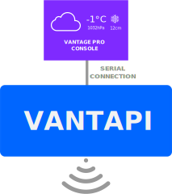

🔴 Work still in progress. No release has been published yet. 🔴

# VantAPI

VantAPI, in short, is a NodeJS Rest API that, with the help of the [vantjs interface](https://github.com/harrydehix/vantjs), allows you to read and record weather data from any Davis Vantage Pro, Pro 2 and Vue console and publish it to the web (or just your internal network) via a secure interface.
Depending on your setup, there are several ways you can use the API.

## Setup Types

#### Setup A

A local device connected to the Vantage console pushes the currently measured weather data to the API server every 5 minutes (changeable) using the **VantAPI Uploader Tool** running in the background. This data gets stored in a _MongoDB database_ on the server. The VantAPI now offers the data and other useful functionality in a structured way to any client making requests using a valid API key. You as admin can create API keys as you like. Advanced features like rate limiting are supported.

🔷 *Requirements*:

- A device that is connected serially to your vantage pro console and is able to run Node.js programs
- A (public) server that is able to run Node.js programs and store data in MongoDB databases

#### Setup B

The public API server is directly connected to the vantage console. Every 5 minutes (changeable) the currently measured weather data gets recorded and stored in a MongoDB database. The VantAPI now offers the data and other useful functionality in a structured way to any client making requests using a valid API key. You as admin can create API keys as you like (and even set a rate limit).

🔷 *Requirements*:

- A (public) server serially connected to the Vantage console that can run NodeJS programs and store data in MongoDB databases

